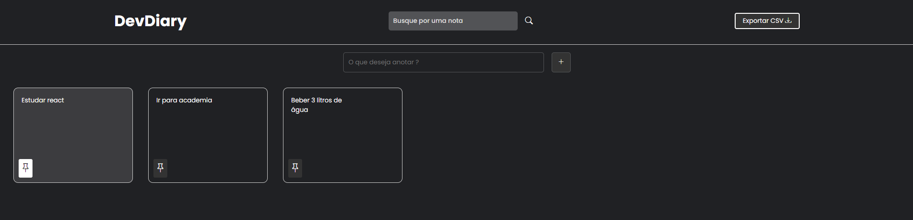

<h1 align="center">✔️DevDiary</h1>

## ❔ Descrição:
Este projeto foi baseado no "google keep" que é um software para criação de anotações, nele é possível criar diversas anotações, procurar por uma específica ou ate mesmo fixar as mais importantes.
Neste projeto usei apenas HTML5,CSS e JavaScript e pude por em prática diversos conceitos fundamentais sobre as linguagens.

Clique <a href="https://dev-diary-zeta.vercel.app/">aqui</a> e veja o projeto no ar 

## 👨‍💻Tecnologias usadas:

   
  
    

